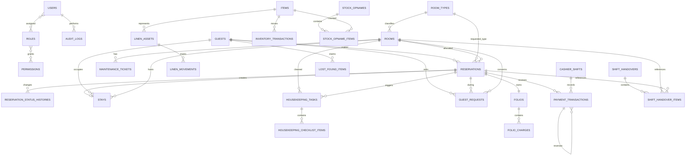
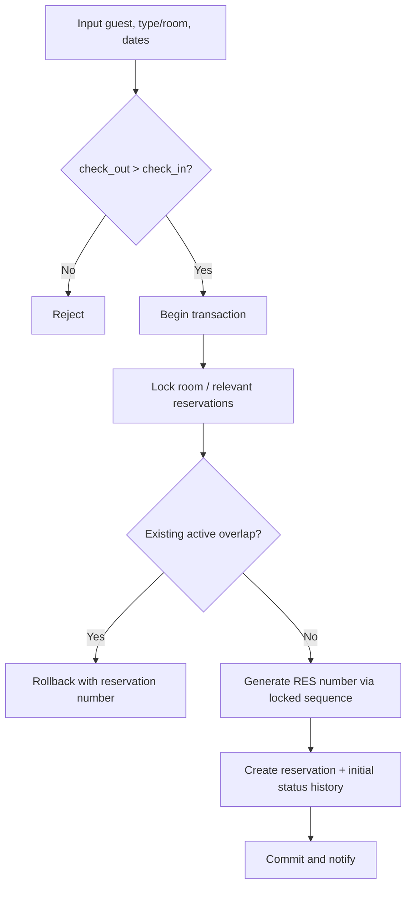
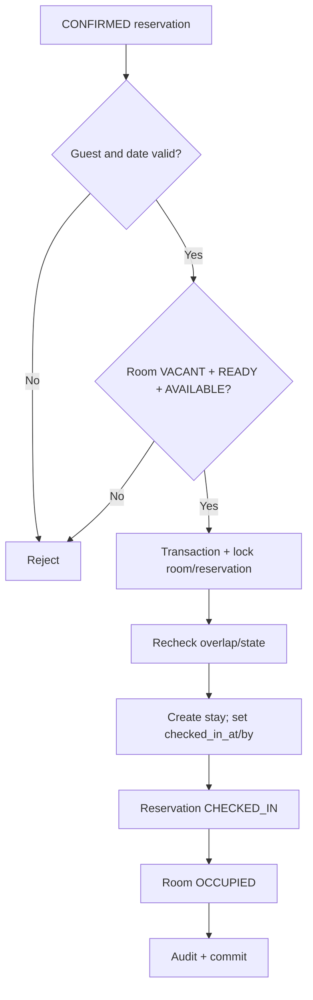
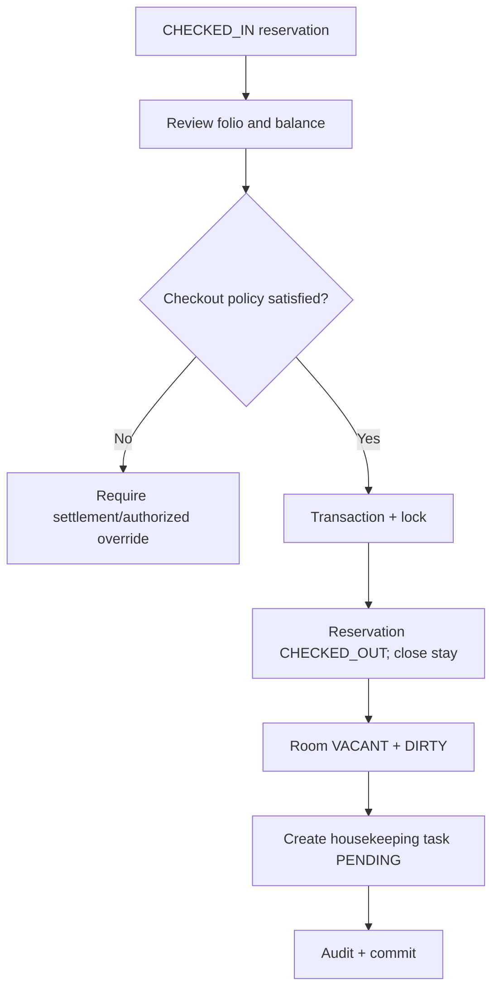
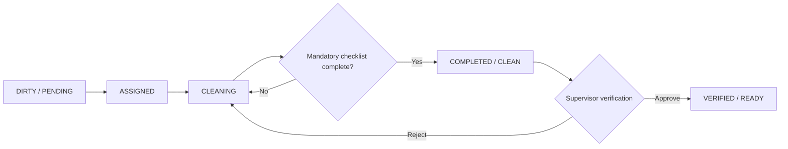
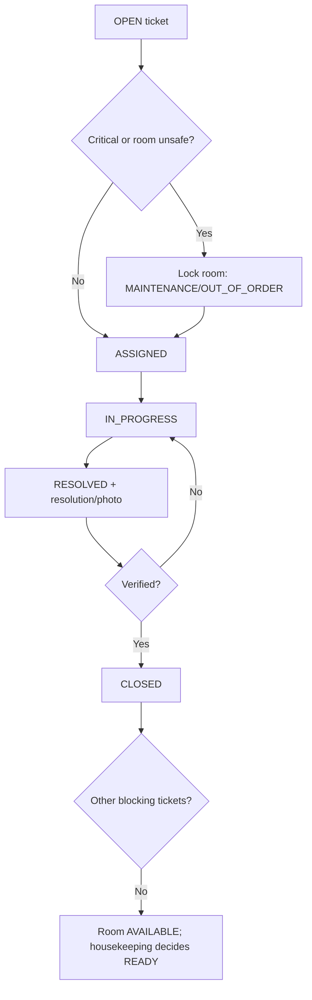
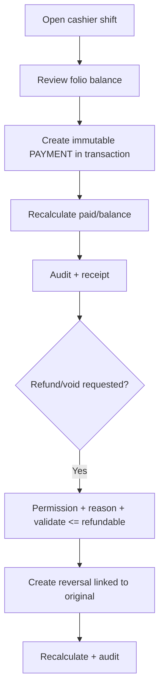

# Hotel Internal Management System — Architecture Blueprint

Dokumen ini adalah baseline arsitektur untuk **Urbanview Daniela Jambi by RedDoorz**. Implementasi dilakukan per phase; tabel berstatus *implemented* sudah tersedia pada Phase 1, sedangkan tabel lain adalah kontrak desain untuk phase berikutnya.

## Implementation Status

Phase 1 Foundation, Phase 2 Front Office, dan Phase 3 Operations sudah diimplementasikan. Phase 3 mencakup mandatory housekeeping checklist, supervisor verification sebelum READY, maintenance work order dan room blocking, Guest Request dengan response time, Lost & Found, serta Shift Handover dengan unfinished item tracking. Secure guest-document upload tetap direncanakan bersama hardening akses file.

## Existing Project Analysis

- Workspace awal hanya berisi `task.md`; tidak ada aplikasi atau repository Git yang perlu dipertahankan.
- Environment: PHP 8.2.12, Composer 2.8.6, Node.js 22.14.0, dan MySQL/MariaDB dari XAMPP.
- Laravel 13 memerlukan PHP 8.3; karena itu Laravel 12 dipilih sebagai rilis terbaru yang kompatibel dengan environment aktual.
- Migration menargetkan MySQL `website_hotel`. Automated test dan fallback runtime lokal memakai SQLite; saat QA, service MariaDB XAMPP macet pada state `Closing tables`, sehingga tidak dipaksa restart demi integritas data.
- Redis belum tersedia dan belum diperlukan pada Phase 1. Kontrak cache/queue memakai driver Laravel sehingga dapat dipindah ke Redis tanpa mengubah domain.

## A. Architecture

### Gaya arsitektur

Modular monolith dipilih karena operasional hotel berada dalam satu bounded application, membutuhkan transaksi lintas modul, dan belum memerlukan kompleksitas distributed system.

```text
app/
├── Domains/
│   ├── Dashboard/
│   ├── Reservation/
│   ├── Guest/
│   ├── Room/
│   ├── Housekeeping/
│   ├── Maintenance/
│   ├── GuestRequest/
│   ├── Inventory/
│   ├── Finance/
│   ├── Staff/
│   ├── Reporting/
│   └── System/
├── Models/                 # Identity/shared framework model
├── Policies/               # Resource authorization
└── Providers/
```

Setiap domain dapat mempunyai `Actions`, `Enums`, `Events`, `Http`, `Livewire`, `Models`, `Notifications`, dan `Queries`. Controller/Livewire menangani input serta orkestrasi UI; mutation penting berada dalam Action class. Query laporan dipisahkan menjadi query object saat Phase 6.

### Aturan dependency

1. Presentation memanggil Action/Query, tidak menulis aturan bisnis di Blade.
2. Action boleh memakai model domain sendiri dan service shared yang eksplisit.
3. Operasi kritis memakai `DB::transaction`; booking dan number sequence memakai row lock.
4. Semua status disimpan sebagai `VARCHAR` dan di-cast ke backed enum. Ini lebih mudah dikembangkan daripada native database enum.
5. Authorization selalu diperiksa di backend melalui middleware dan Policy/Gate. Visibility menu hanya lapisan UX.
6. Audit log append-only; payment/inventory tidak pernah dihapus untuk “mengoreksi” histori.
7. Uang memakai `DECIMAL(15,2)`, tidak pernah float/double.

### Stack

- Laravel 12.69, PHP 8.2 kompatibel (upgrade PHP 8.3+ membuka jalur Laravel 13)
- Livewire 4, Alpine bawaan Livewire, Tailwind CSS 4
- Spatie Laravel Permission 6
- MySQL untuk deployment; SQLite in-memory untuk automated test
- Database queue/notification pada awal, Redis dapat menggantikan driver melalui konfigurasi

## B. Database

### Foundation — implemented

| Table | Tujuan | Relasi penting |
|---|---|---|
| `users` | Akun staf, status aktif, login terakhir, soft delete | M:N roles |
| `roles`, `permissions` | RBAC granular | Pivot Spatie ke users/roles |
| `room_types` | Master tipe, tarif, kapasitas | 1:N rooms |
| `rooms` | Master kamar dan tiga dimensi status | N:1 room_types |
| `audit_logs` | Jejak perubahan append-only | N:1 users (nullable) |
| `sessions`, `password_reset_tokens` | Infrastruktur auth | user optional |
| `cache`, `cache_locks`, `jobs`, `job_batches`, `failed_jobs` | Infrastruktur Laravel | — |

### Front Office — Phase 2

| Table | Kolom/tujuan utama | Relasi |
|---|---|---|
| `guests` | guest_code, identitas, kontak, blacklist, notes | 1:N reservations, stays, requests |
| `guest_documents` | private storage path, MIME, size, uploaded_by | N:1 guests |
| `reservations` | number, guest, type/room, dates, source, rate, totals, status, timestamps check-in/out | N:1 guest/type/room/users |
| `reservation_status_histories` | from/to status, reason, actor, timestamp | N:1 reservations/users |
| `stays` | actual room/check-in/check-out snapshot | N:1 reservation/guest/room |
| `document_sequences` | document_type + business_date + current_value | Unique per type/date; locked on increment |

Indeks reservasi: unique `reservation_number`; index pada `guest_id`, `room_id`, `(check_in_date, check_out_date)`, `reservation_status`, `booking_source`, `payment_status`, dan `created_at`. Rule overlap tetap diperiksa dalam locked transaction karena constraint SQL biasa tidak dapat merepresentasikan interval overlap.

### Operations — Phase 3

| Table | Tujuan | Relasi |
|---|---|---|
| `housekeeping_tasks` | Room cleaning workflow, assignee, timing, verification | N:1 room/reservation/users |
| `housekeeping_checklist_items` | Snapshot checklist mandatory dan hasil per task | N:1 task/users |
| `maintenance_tickets` | Work order, severity, assignment, resolution, photo paths | N:1 room/users |
| `guest_requests` | Request/complaint, priority, department, response timing | N:1 guest/reservation/room/users |
| `shift_handovers` | Shift header dan penerima | N:1 creator/receiver |
| `shift_handover_items` | Room/reservation/category/work status | N:1 handover/room/reservation |
| `lost_found_items` | Penemuan, storage, claim/return trail | N:1 guest/reservation/users |

### Finance — Phase 4

| Table | Tujuan | Relasi |
|---|---|---|
| `folios` | Satu ledger ringkas per reservation | 1:1 reservation |
| `folio_charges` | ROOM/EXTRA_BED/etc.; quantity × unit_price | N:1 folio/reservation/users |
| `payment_transactions` | PAY number, method, amount, type PAYMENT/REFUND/VOID, immutable | N:1 reservation/shift/users, self-reference original payment |
| `cashier_shifts` | Opening/closing, expected/actual, difference | N:1 user |

Total folio dihitung dari charge dan discount; balance = total charge − valid payment + refund. Nilai ringkasan pada reservation adalah snapshot/cache dan harus direkonsiliasi oleh service.

### Inventory — Phase 5

| Table | Tujuan | Relasi |
|---|---|---|
| `items` | SKU, category, unit, current/minimum stock | 1:N transactions |
| `inventory_transactions` | Immutable stock movement + balance_after | N:1 item/users/reference |
| `stock_opnames` | Header proses stock count | N:1 users |
| `stock_opname_items` | System vs counted qty dan adjustment ref | N:1 opname/item/transaction |
| `linen_assets` | Optional batch/item linen dan current state | N:1 item/room |
| `linen_movements` | CLEAN/IN_ROOM/DIRTY/LAUNDRY/DAMAGED/LOST trail | N:1 linen/item/room/users |

### System/notification

| Table | Tujuan |
|---|---|
| `settings` | Key/value typed, encrypted flag, group; tidak hardcode aturan bisnis |
| `notifications` | Database notification Laravel |
| `notification_preferences` | Channel preferences future-ready |

### Migration roadmap

1. Users/framework tables and permission pivots.
2. User hotel fields, room types, rooms, audit logs. **Implemented.**
3. Guests/documents, safe number sequences, reservations/status history/stays.
4. Housekeeping tasks/checklist items, maintenance, guest requests, handover, lost & found. **Implemented.**
5. Folios, charges, payments/reversals, cashier shifts.
6. Items/inventory movements/opname, linen tracking.
7. Settings and database notifications.

## C. ERD



## Models

- Phase 1: `User`, `Role`, `Permission`, `RoomType`, `Room`, `AuditLog`.
- Phase 2: `Guest`, `GuestDocument`, `Reservation`, `ReservationStatusHistory`, `Stay`, `DocumentSequence`.
- Phase 3: `HousekeepingTask`, `HousekeepingChecklistItem`, `MaintenanceTicket`, `GuestRequest`, `ShiftHandover`, `ShiftHandoverItem`, `LostFoundItem`.
- Phase 4: `Folio`, `FolioCharge`, `PaymentTransaction`, `CashierShift`.
- Phase 5: `Item`, `InventoryTransaction`, `StockOpname`, `StockOpnameItem`, `LinenAsset`, `LinenMovement`.
- System: `Setting`, framework `DatabaseNotification`.

## Modules

Dashboard, Reservation, Guest, Room, Housekeeping, Maintenance, Guest Request, Inventory, Finance/Cashier, Staff/Handover, Reporting, dan System. Modul berbagi ID/relation, tetapi mutation hanya melalui Action domain pemilik.

## Route map

Implemented routes menggunakan session auth + active-user middleware:

| Method | Route | Permission |
|---|---|---|
| GET/POST | `/login` | Guest + rate limit di request |
| POST | `/logout` | Authenticated |
| GET | `/dashboard` | `dashboard.view` |
| GET | `/system/users` | `user.view` |
| GET | `/system/roles` | `role.view` |
| GET | `/system/rooms` | `room.view` |
| GET | `/system/room-types` | `room_type.view` |
| GET | `/system/audit-logs` | `audit.view` |
| GET | `/operations/housekeeping` | `housekeeping.view` |
| GET | `/operations/guest-requests` | `guest_request.view` |
| GET | `/operations/maintenance` | `maintenance.view` |
| GET | `/operations/lost-found` | `lost_found.view` |
| GET | `/staff/shift-handover` | `shift_handover.view` |

Prefix `/front-office` sudah aktif untuk reservations, room board, check-in, in-house, check-out, dan guests. Prefix `/operations` sudah aktif untuk housekeeping, guest requests, maintenance, dan lost & found; `/staff/shift-handover` juga sudah aktif. Prefix berikutnya: `/inventory`, `/finance`, dan `/reports`. Mutating Livewire calls tetap melakukan Policy/Gate check, bukan bergantung pada GET page route.

## D. Permissions

### Permission catalog

- Dashboard: `dashboard.view`
- Reservation: `reservation.view/create/update/cancel`
- Guest: `guest.view/create/update`
- Room: `room.view/create/update/delete/update_status`
- Room type: `room_type.view/create/update/delete`
- Stay: `checkin.execute`, `checkout.execute`
- Payment: `payment.view/create/refund/void`
- Housekeeping: `housekeeping.view/update/assign/verify`
- Maintenance: `maintenance.view/create/update/assign/verify`
- Guest request: `guest_request.view/create/update/assign`
- Inventory: `inventory.view/create/adjust`
- Cashier: `cashier.view/open/close`
- Handover: `shift_handover.view/create/update`
- Lost & found: `lost_found.view/create/update`
- Report: `report.view/export`
- System: `user.view/create/update/deactivate/assign_role/assign_owner`, `role.view/create/update/delete`, `permission.view`, `settings.manage`, `audit.view`

### Role matrix

| Role | Scope |
|---|---|
| Owner | Semua permission |
| Manager | Seluruh operasional/report/audit; tanpa user/role/settings administration |
| Receptionist | Reservation, guest, room read, check-in/out, payment entry, cashier read, handover |
| Housekeeping | Room read/status, housekeeping, inventory read, guest request read |
| Maintenance | Room read/status, maintenance, inventory read, guest request read |
| Finance | Reservation/guest read, payment/refund/void, cashier, report |
| Administrator | User, role, permission, settings, audit, room/room type master |

## E. Workflow

### Reservation



Overlap rule: `existing.check_in < new.check_out AND existing.check_out > new.check_in`, excluding `CANCELLED` and `NO_SHOW`. Frontend availability is advisory; backend locked validation adalah sumber kebenaran.

### Check-In



### Check-Out



### Housekeeping



### Maintenance



### Payment/refund



## F. Sidebar

- Dashboard
- FRONT OFFICE: Reservations, Room Board, Check-In, In-House, Check-Out, Guests
- OPERATIONS: Housekeeping, Guest Requests, Maintenance, Lost & Found
- INVENTORY: Items, Stock Transactions, Linen, Stock Opname
- FINANCE: Cashier, Payments, Transactions, Cashier Closing
- STAFF: Employees, Shift Handover
- REPORTS: Occupancy, Revenue, Reservations, Housekeeping, Maintenance, Inventory
- SYSTEM: Users, Roles, Permissions, Room Master, Room Types, Audit Logs, Settings

Hanya item yang route-nya sudah diimplementasikan ditampilkan pada Phase 1. Setiap item memakai `@can`, dan route/action tetap dilindungi middleware/Policy.

## G. Development Roadmap

1. **Foundation (implemented):** auth internal, active user guard, RBAC, responsive shell/sidebar, audit trail, room type/master, enum status, seeders, tests.
2. **Front Office (implemented):** guest + duplicate detector; safe number sequence; reservation availability and overlap lock; Room Board; check-in/stay/check-out transaction; checkout creates pending housekeeping task.
3. **Operations (implemented):** snapshot housekeeping checklist, mobile boards, maintenance/room blocking, guest request response time, lost & found, dan shift handover.
4. **Finance:** folio, charge, immutable multi-payment, reversal/refund, cashier shift/closing and reconciliation.
5. **Inventory:** items, locked movement service, minimum stock alert, stock opname, pragmatic linen tracking.
6. **Reporting:** indexed aggregate queries, snapshot/queue where needed, Excel export if dependency is accepted, printable views.
7. **Hardening:** MySQL concurrency suite, queue/scheduler monitoring, storage access policies, backup/restore rehearsal, production security checklist.

Setiap modul melalui urutan migration/model → action/policy → UI → audit → feature test → query/security review.

## H. Risk Analysis

| Risiko | Mitigasi |
|---|---|
| Double booking | Validasi interval di frontend dan backend; transaction; lock room/reservation rows; status exclusion eksplisit; test konkurensi di MySQL |
| Race condition | `lockForUpdate()` pada room, sequence, inventory balance, payment/folio; idempotency key untuk command sensitif |
| Permission leak | Route middleware + Policy/Gate pada action Livewire; negative authorization tests; tidak mengandalkan hidden menu |
| Financial inconsistency | Immutable ledger, reversal linked to original, decimal money, transaction, recompute/reconciliation, mandatory reason/audit |
| Stock inconsistency | Semua perubahan melalui inventory transaction service, row lock item, `balance_after`, aturan non-negative configurable |
| Room status inconsistency | Tiga enum terpisah; transition service; check-in/out/housekeeping/maintenance mengubah state dalam satu transaction |
| N+1 query | Eager loading/withCount, pagination, query budget pada dashboard/report, indeks field filter |
| Audit log gap | Audit dipanggil di Action yang sama dan transaction yang sama; log auth/permission/financial/status; append-only access |
| Sensitive upload exposure | Private disk, random filename, MIME/signature/size validation, authorized download endpoint, no user filename trust |
| Number collision | `document_sequences` unique `(type,date)`, increment under row lock; tidak memakai `count()+1` |
| Timezone/date boundary | Store timestamps consistently, business timezone `Asia/Jakarta`, explicit hotel business date untuk sequence/report |
